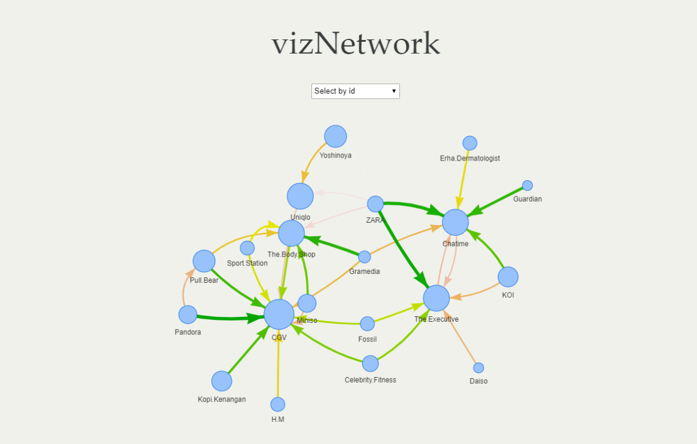

# TenantViz

TenantViz is a project about Tenant Synergy Analysis and its network visualization using `visNetwork`. 

## Introduction

In the case of **Mall Management**, It is often needed to manage various types and numerous Tenants in a single mall. We need to identify how big the **financial value** that each Tenant can bring to the Mall and how each tenant can affect other tenant's business **(tenant synergy)**.

We've developed 2 approaches to perform Tenant Synergy Analysis that is using:

* **The Correlation of Daily Sales for each Tenant**
    - Pros: The model is easy to implement  
    - Cons: The assumption made this approach too simplistic since daily high sales might come from a different set of customers that day.  

* **Customer Shopping Association Rules**
    - Pros: The matrices for size and line weight is generated using the same model of customer's behaviour.  
    - Cons: The model needs a customer's identifier for each sales/visit to a tenant.

Both can further be visualized for easier interpretation using `visNetwork`.

    

## Inside this Repository

This repository contains: 

- latest progress on this project (ppt-milestone.html)
- documentation of basic idea of TenantViz (tenants.html / .rmd). 
- tenant synergy analysis using correlation of daily sales (correlation-based.html / .rmd)
- tenant synergy analysis using association rules (correlation-based.html / .rmd)

All the data used for this project were stored in data_input.

## Maintainer

* Nabiilah
* Tiara
* credit to [Steven Surya Tanujaya](https://www.linkedin.com/in/stevensurya/) who also contributed in the development of first idea of TenantViz! :)

